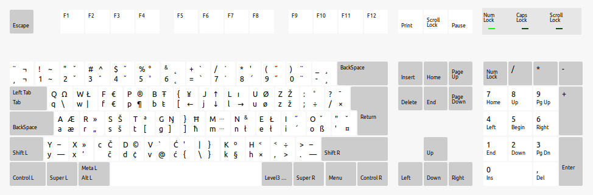

= Custom key mapping
:toc:
:sectnums:
:sectnumlevels: 3

---

* using link:https://www.keybr.com/[keybr] to learn how to type faster (enable capital letters and punctuation)
* using link:https://10fastfingers.com/[10fastfungers] to track progress

---

== Alternative to QWERTY
* Colemak
* link:https://colemakmods.github.io/mod-dh/[Colemak Mod-DH] - probably the best alternative?
* Dvorak

=== Colemak-DH wide angle mode
* My keyboard layout 
* Keyboard layout copied from this link:https://raw.githubusercontent.com/DreymaR/BigBagKbdTrix/master/docs/res/cmk/Cmk-ISO-eD-CurlAWide_96d-FShui.png[picture]
which is from this link:https://forum.colemak.com/topic/1438-dreymars-big-bag-of-keyboard-tricks-linuxxkb-files-included/[forum]

* 2021/01/23: stared to learn Colemak-DH wide angle mode
** stopped learning after two weeks
+
[NOTE]
====
I would guess that it is probably good to learn Colemak-DH,
but right now there is no default support for it and problem with slovenian letters, vim, AwesomeWm shortcuts... still persists.
====

=== Setup custom layout
. Copy custom layout: `cp xkb/symbols/si_colemak /usr/share/X11/xkb/symbols/`
. Change layout: `setxkbmap si_colemak`
. Revert back: `setxkbmap si` (or `us`...)

==== link:keymap.sh[]
You can also use the provided link:keymap.sh[] script:

. Copy custom layout: `cp xkb/symbols/si_colemak /usr/share/X11/xkb/symbols/`
. Copy script: `mkdir -p ~/.config/keymap/ && cp keymap.sh ~/.config/keymap/`
. Run script to toggle between layouts: `~/.config/keymap/keymap.sh`

===== Usage
* Set "si" layout: `keymap.sh si`
* Set "si_colemak" layout: `keymap.sh si_colemak`
* Toggle between "si" and "si_colemak" layouts: `keymap.sh`
* Get current layout: `keymap.sh get`

== Setup for windows (only CAPS to Backspace)
- link:windowsSetup.adoc[]

== Useful links
* link:https://forum.colemak.com/topic/2671-vipers-ergonomics-guide/[Viper's Ergonomics Guide]
* link:https://forum.colemak.com/topic/2681-my-software-layout-machine-analysis/[My software layout machine analysis]
* link:https://alexarmstrong.net/2015/01/reassign-capslock-to-backspace[Reassign capslock to backspace]
