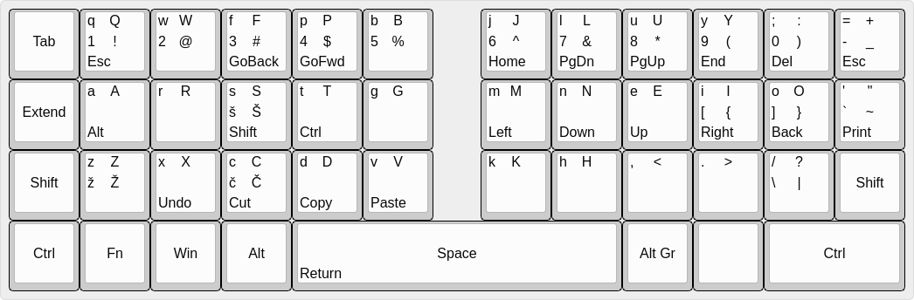

==================
Custom key mapping
==================

:Info: Custom keymap notes

:Authors:
    Bzgec

.. contents:: Table of Contents
   :depth: 2

MOVED TO `GitLab <https://gitlab.com/bzgec/keymap>`__
=====================================================

My Slovenian Colemak-DH angle mode
==================================

- Using 3x6 layout to minimize finger movement
- Using 5 layers:

  - Layer 1: <key>
  - Layer 2: Shift + <key>
  - Layer 3: AltGr + <key>
  - Layer 4: AltGr + Shift + <key>
  - Layer 5: Extend + <key>

Image is generated with `keyboard-layout-editor.com <http://www.keyboard-layout-editor.com/#/>`__.
You can upload `<keyboard-layout-editor.com.json>`__ to start editing from above layout.

Learning to type and tracking typing speed
==========================================

- `keybr <https://www.keybr.com/>`__: learn to type (enable capital letters and punctuation)
- `monkeytype <https://monkeytype.com/>`__: useful for tracking speed
- `10fastfingers <https://10fastfingers.com/>`__

Setup custom layout
===================

Linux
-----

1. Copy custom layout: `cp xkb/symbols/si_colemak /usr/share/X11/xkb/symbols/`
2. Change layout: `setxkbmap si_colemak`
3. Revert back: `setxkbmap si` (or `us`...)

- Check `<keymap.sh>`__ to enable automatic toggling from single script.

  1. Copy custom layout: `sudo cp xkb/symbols/si_colemak /usr/share/X11/xkb/symbols/`
  2. Copy script: `mkdir -p ~/.config/keymap/ && cp keymap.sh ~/.config/keymap/`
  3. Run script to toggle between layouts: `~/.config/keymap/keymap.sh`

  - Usage

    - Set "si" layout: `keymap.sh si`
    - Set "si_colemak" layout: `keymap.sh si_colemak`
    - Toggle between "si" and "si_colemak" layouts: `keymap.sh`
    - Get current layout: `keymap.sh get`

Setup for Windows
-----------------

- `Software to enable custom layout <https://github.com/DreymaR/BigBagKbdTrixPKL>`__
- Use `<Cmk-eD_ISO_CurlAngle-my.ini>`__

Other
=====

- `All about Colemak mods <https://colemakmods.github.io/mod-dh/>`__
- `Dreymar - all about Extend <https://dreymar.colemak.org/layers-extend.html>`__
- `Dreymar - extend layer <https://forum.colemak.com/topic/2675-share-your-favorite-extend-tricks/>`__
- `Viper's Ergonomics Guide <https://forum.colemak.com/topic/2671-vipers-ergonomics-guide/>`__
- `Viper's software layout machine analysis <https://forum.colemak.com/topic/2681-my-software-layout-machine-analysis/>`__
- Define the behaviour of the decimal point key on the numpad. (More accurately,
  imports such behaviour override from `/usr/share/X11/xkb/symbols/kpdl`.): `include "kpdl(comma)"`
- `TMK Products/Keyboard <https://github.com/tmk/tmk_keyboard/wiki>`__
- `XEV - print contents of X events <https://linux.die.net/man/1/xev>`__
- `Florence <http://florence.sourceforge.net/english.html>`__: display keyboard layout
